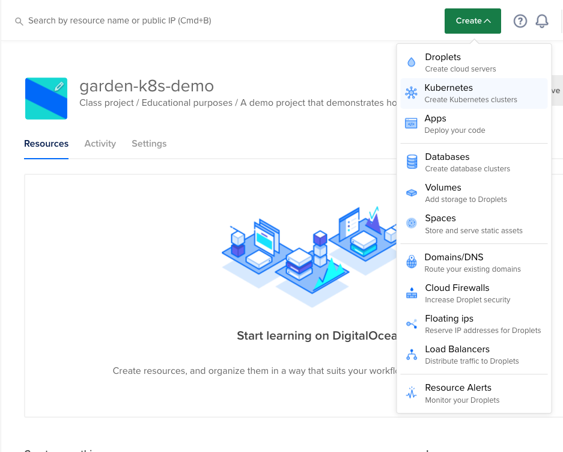
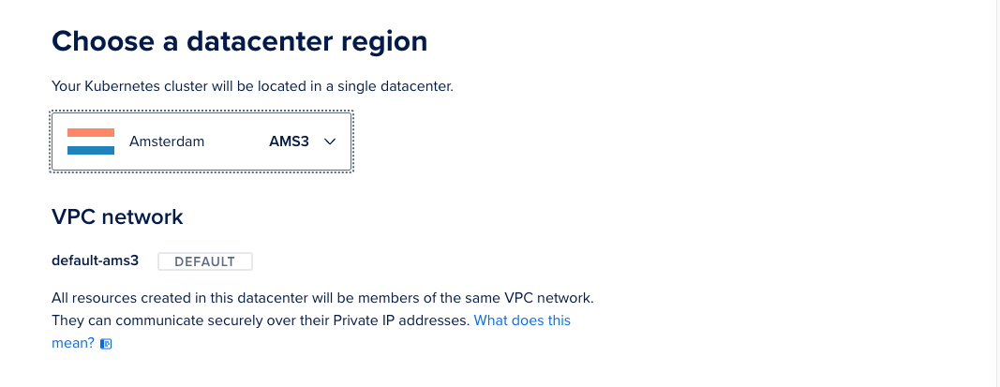
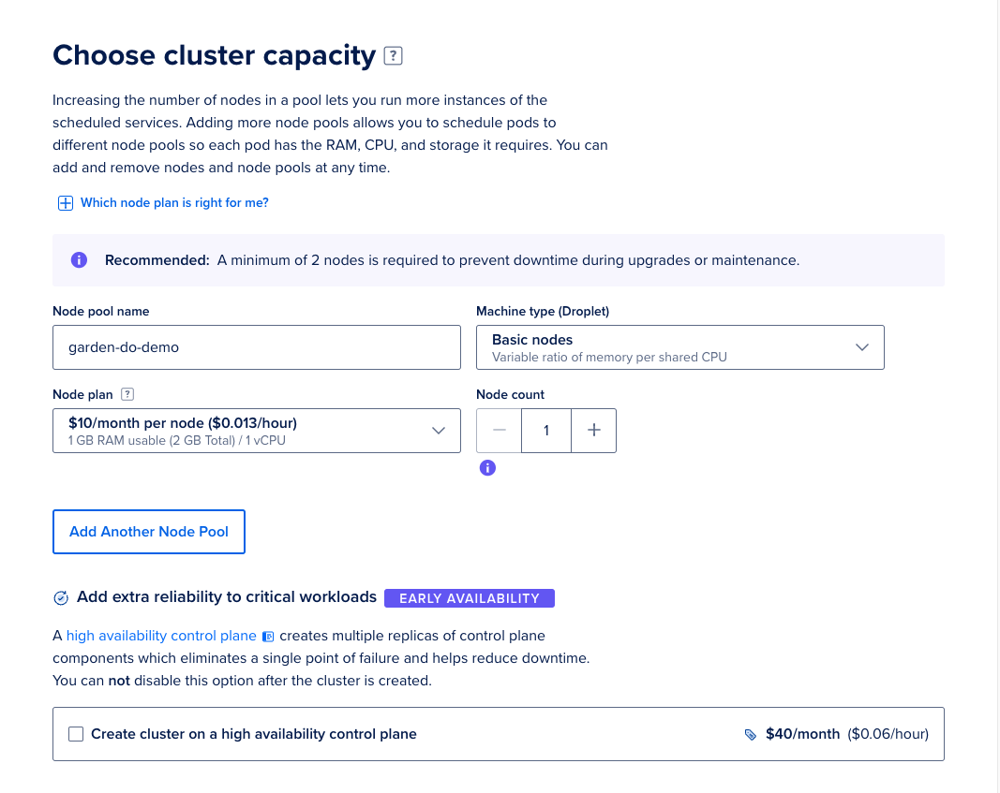
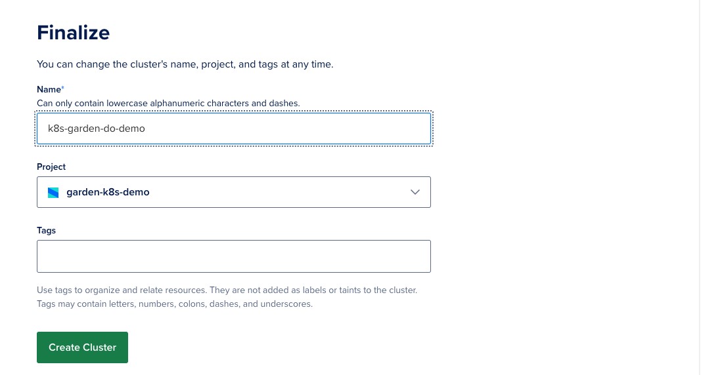
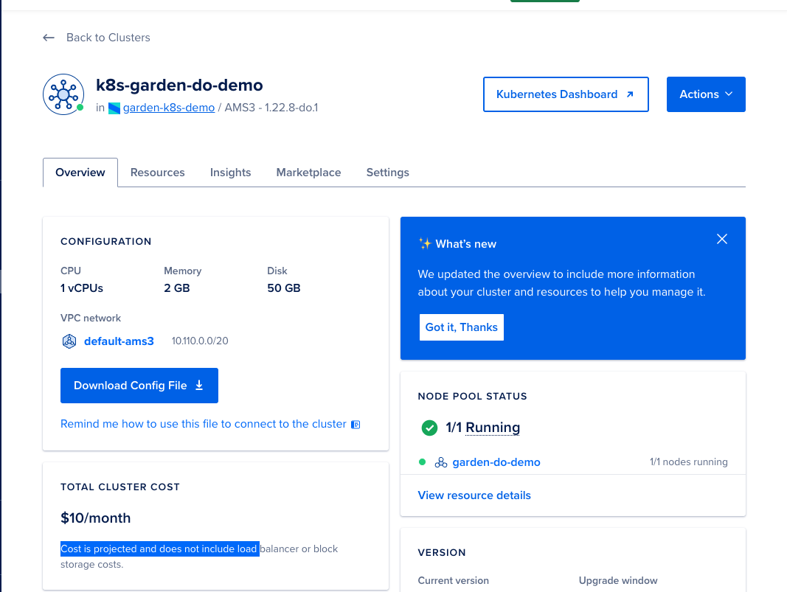
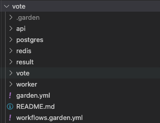
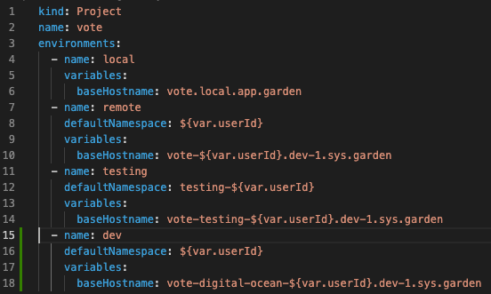
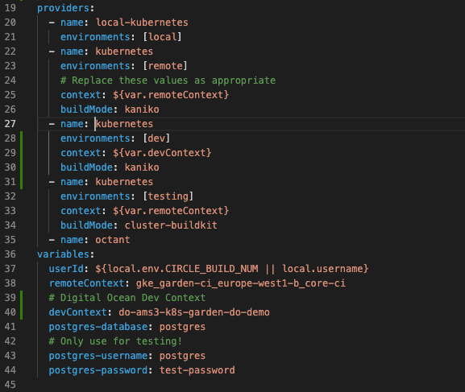
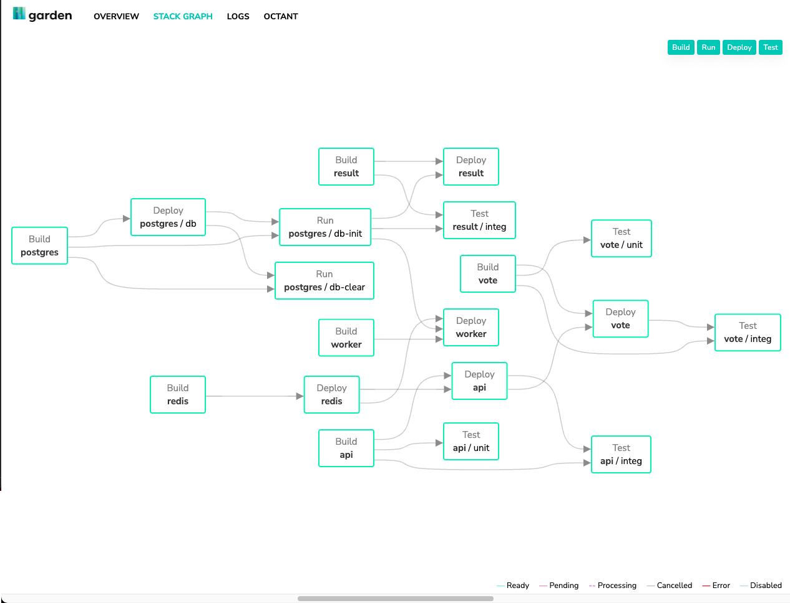

# Setting up a Digital Ocean Kubernetes cluster and Garden from scratch

Digital Ocean Kubernetes service (DOKS) is a managed Kubernetes service that allows you to deploy K8s clusters without the complexity of handling the control plane and infrastructure.

The clusters created with DOKS are compatible with standard K8s tooling and integrate natively with Digital Ocean’s Load Balancers and block storage volumes

Garden integrates natively with DOKS and has no major configuration overhead.

In this article, we are going to create a Kubernetes cluster using DOKS and deploy the vote example project to it using Garden.

We’re also going to use the in-cluster building feature to build our images in our DOKS cluster.

## Creating a new cluster from the control panel

We can create a Digital Ocean Kubernetes cluster from the [DigitalOcean Control Panel](https://cloud.digitalocean.com/) by clicking the **Create** dropdown menu in the top right and selecting Kubernetes.



We will be taken to the **Create a cluster** page to configure our cluster.

1. **Kubernetes version**

You can select the default version (which translates to the latest stable release of Kubernetes) for our use-case.


*Note: Garden [supports the latest six stable versions](https://docs.garden.io/guides/remote-kubernetes#requirements) of Kubernetes. DOKS has its own cluster versioning system, which [supports the latest version of Kubernetes](https://docs.digitalocean.com/products/kubernetes/changelog/).*

2. **Datacenter region**

We have selected Amsterdam (AMS3) as our datacenter. All resources in this datacenter will form part of the same [VPC network](https://docs.digitalocean.com/products/networking/vpc/), and they can communicate securely over their private IP addresses. If you plan to use [Digital Ocean block storage volumes](https://docs.digitalocean.com/products/kubernetes/how-to/add-volumes/), make sure you select a [region with block storage support](https://docs.digitalocean.com/products/volumes/#regional-availability).

If required, you can [create your own VPC network](https://docs.digitalocean.com/products/networking/vpc/quickstart/), however for the purposes of this article, we will use the default.



*Note: If you add a [Digital Ocean Load Balancer](https://docs.digitalocean.com/products/kubernetes/how-to/add-load-balancers/) to your deployment, it will be automatically be created in the same region as your cluster.*

3. **Cluster capacity**

Next we’ll configure the compute resources we want to assign to our cluster.

We need to add at least one node pool. A node pool is a group of nodes in a cluster that all have the same configuration – all worker nodes in a node pole have identical compute resources.

For this article, we'll configure a minimal node pool called `garden-do-demo`, containing a single worker node with 1GB of usable RAM and 1vCPU, and an additional node pool containing a single worker with 4GB RAM and 2vCPU.

It is important to note that all nodes inside a pool will inherit the naming scheme we specify in our pool name.



Single node clusters are a fine tool to experiment with and learn Kubernetes, however it is not recommended to run with the single node configuration in a production environment, as it does not shield you against upgrade and maintenance downtime.

4. **Finalize and create**

Finally, give your cluster a name and add it to a project. You can also add tags to your cluster before creating it. Tags can be used to organize and relate resources in a cluster. When you’re happy with the configuration, hit **Create Cluster**. Cluster creation can take several minutes to complete.



*Note: It is important to take note of the monthly rate for your cluster. You can see this on the **Create Cluster** screen before you hit **Create Cluster.***


Once cluster creation is complete, your cluster will be provisioned and ready to use.



## Connecting to the cluster from your development machine

Once your cluster has been provisioned, you need to connect to your cluster from your development machine.

We recommend installing and using [Kubernetes official client](https://kubernetes.io/docs/tasks/tools) to interact with your DOKS cluster.

To connect to the cluster, we need to add an authentication token or certificate to the `kubectl` configuration file.

We can do this using [`doctl`](https://docs.digitalocean.com/reference/doctl/how-to/install/), an automated tool from Digital Ocean to authenticate with your cluster and update its configuration.

Once `doctl` is installed and set up, run the below command to authenticate with your cluster:

```jsx
doctl kubernetes cluster kubeconfig save <your-cluster-id>
```

You should see the following output:

```jsx
Notice: Adding cluster credentials to kubeconfig file found in "/Users/<username>/.kube/config"
Notice: Setting current-context to <your-cluster-context>
```

You can get the cluster ID from the **View Cluster** page.

If you’d prefer to not use `doctl`, you can also connect manually using the cluster configuration file that you can [download from the control panel](https://docs.digitalocean.com/products/kubernetes/how-to/connect-to-cluster/#download).

We can validate that our configuration is working as expected by running the following in a terminal:

`kubectl cluster-info`

You should see the following output:

```jsx
% kubectl cluster-info
Kubernetes control plane is running at https://{cluster-id}.k8s.ondigitalocean.com
CoreDNS is running at https://{cluster-id}.k8s.ondigitalocean.com/api/v1/namespaces/kube-system/services/kube-dns:dns/proxy
```

## Configuring the vote project to use our DOKS cluster

We’re going to deploy the [vote demo project](https://github.com/garden-io/garden/tree/master/examples/vote) to our newly created and provisioned cluster.

Fetch the code from the Garden repository by running:

```jsx
git clone git@github.com:garden-io/garden.git
```

Then open up the project in your IDE and navigate to `examples/vote`.



We are going to modify `garden.yml` in the root of the vote project as follows:

- Edit the `environments` block to add a new environment called `dev`.



- Edit the `providers` block to add a new `kubernetes` provider - this provider uses our new `dev` environment.
- Edit the `variables` block to have a new variable called `devContext`, which has the value of our newly added Kubernetes context. You can get the name of the current context from the configuration outputted by running `kubectl config view --minify`.



*Note: We specify the kaniko `buildMode`, an [in-cluster build mode](https://docs.garden.io/guides/in-cluster-building) that uses individual [kaniko](https://github.com/GoogleContainerTools/kaniko) pods for each build. We also do not explicitly specify a container registry, as Garden provides a [default in-cluster registry](https://docs.garden.io/guides/in-cluster-building) for us.*

## Initialising Garden in our DOKS cluster

Once we’ve verified that our cluster is provisioned, and that we can connect to it from our development machine, we need to initialise Garden in our cluster.

We’ve already updated our `kubectl context` to point to our Digital Ocean cluster by using `doctl` , so we just need to run:

```jsx
garden --env=dev plugins kubernetes cluster-init
```

The above command will install and update cluster-wide services that Garden needs to operate, for our new `kubernetes` provider that we configured in the previous step. The `--env` flag specifies the environment name we want to configure with Garden. In our case, we’re going to use `dev`.

We should see the following output:

```jsx
Initializing/updating cluster-wide services for dev environment ⚙️

ℹ providers                 → Getting status...
   ℹ providers                 → Getting status...
   ✔ providers                 → Getting status... → Done
ℹ providers                 → Preparing environment...
   ℹ kubernetes                → Configuring...
   ✔ kubernetes                → Configuring... → Ready
✔ providers                 → Preparing environment... → Done

ℹ providers                 → Getting status...
✔ providers                 → Getting status... → Cached
   ℹ Run with --force-refresh to force a refresh of provider statuses.
ℹ providers                 → Getting status...
✔ providers                 → Getting status... → Cached
   ℹ Run with --force-refresh to force a refresh of provider statuses.
Updating builder auth secret
ℹ providers                 → Getting status...
✔ providers                 → Getting status... → Cached
   ℹ Run with --force-refresh to force a refresh of provider statuses.
ℹ docker-registry           → Building version v-f465814e27...
ℹ registry-proxy            → Building version v-82b66dd00f...
✔ registry-proxy            → Building version v-82b66dd00f... → Done (took 0 sec)
ℹ registry-proxy            → Deploying version v-8f7bab71bd...
✔ docker-registry           → Building version v-f465814e27... → Done (took 9.1 sec)
ℹ docker-registry           → Deploying version v-fd56a6a9c5...
   ℹ registry-proxy            → Waiting for resources to be ready...
   ℹ registry-proxy            → DaemonSet/garden-registry-proxy: Pulling image "envoyproxy/envoy-alpine:v1.11.0"
   ℹ registry-proxy            → Resources ready
✔ registry-proxy            → Deploying version v-8f7bab71bd... → Done (took 25.5 sec)
   ℹ docker-registry           → Waiting for resources to be ready...
   ℹ docker-registry           → Resources ready
✔ docker-registry           → Deploying version v-fd56a6a9c5... → Done (took 46 sec)
Cleaning up old resources...

Done!
```

We should now be able to run the following command and see two new namespaces: one called `garden-system` and one called `vote-{userId}`, where `userId` is the system username on your development machine.

```jsx
% kubectl get ns
```

```jsx

NAME              STATUS   AGE
default           Active   39m
garden-system     Active   2m39s
kube-node-lease   Active   39m
kube-public       Active   39m
kube-system       Active   39m
vote-{userId}        Active   2m40s
```

*Note: If we need to uninstall the cluster-wide Garden services, we can run:*

```jsx
garden --env=dev plugins kubernetes uninstall-garden-services
```

## Building and deploying the vote project to our remote cluster

If you run `kubectl get deployments --namespace=vote-{userId}` now, you'll notice we do not have any resources deployed into the cluster yet. We need to now build and deploy the vote project using Garden.

To deploy your resources into the cluster, run the following Garden command in the project directory:

```jsx
garden deploy --env=dev
```

This will take a few minutes the first time we run it, as Garden will now build all the images required *in the cluster* as well as create all the resources that are described in the vote project.

Once this command has completed, we should be able to see the resources listed in our cluster.

```jsx
% kubectl get pods --namespace={your-namespace}
NAME                          READY   STATUS    RESTARTS   AGE
api-947c8dbb8-rqbcc           1/1     Running   0          87m
db-596866b5d6-7j75r           1/1     Running   0          26h
garden-util-54d987cc7-2mrhn   2/2     Running   0          88m
redis-79c76c4dd9-xbtj8        1/1     Running   0          26h
result-5cf84b5587-7v77m       1/1     Running   0          17m
vote-86c5786489-kpvdq         1/1     Running   0          15m
worker-6cf6c6fbf4-5wx6v       1/1     Running   0          16m
```

*Note: The namespace we’re concerned about should be called vote-{userId}, where `userId` is your username on your development machine.*

We can also see what services we have deployed through the Garden dashboard. Run the following command in your terminal to spin it up. A localhost URL should be printed to your console.

```jsx
% garden dashboard --env=dev
```



Lastly, we can check the status of our Garden deployment by running the `get status` command:

```jsx
% garden get status --env=dev
```

This will check and output the full status of our `dev` environment.

## Next steps

In this article we covered the steps involved in creating and configuring a managed Kubernetes cluster using Digital Ocean, as well as configuring a Garden project to use a DOKS cluster as a deployment target. 

From here, you could look at [enabling `dev mode`](https://docs.garden.io/guides/code-synchronization-dev-mode) to synchronise code to and from your containers to tighten the developer feedback loop even further. 

You could also explore setting up a [remote deployment registry](https://docs.garden.io/guides/in-cluster-building#Configuring-a-deployment-registry) to [store container images](https://www.digitalocean.com/products/container-registry), to reduce the load on your cluster.
